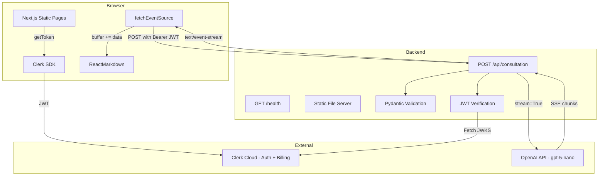
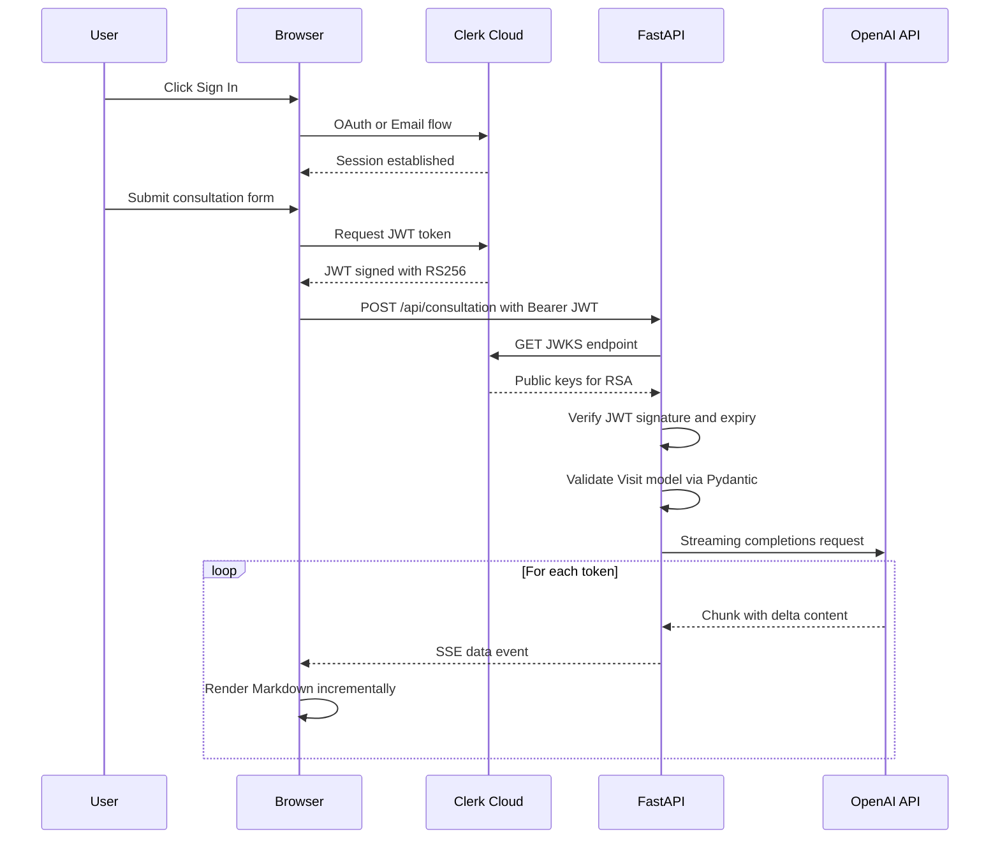
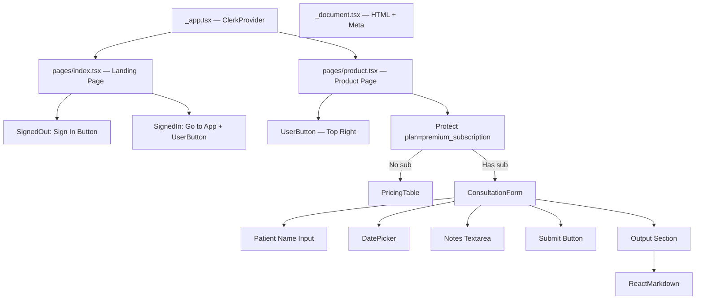
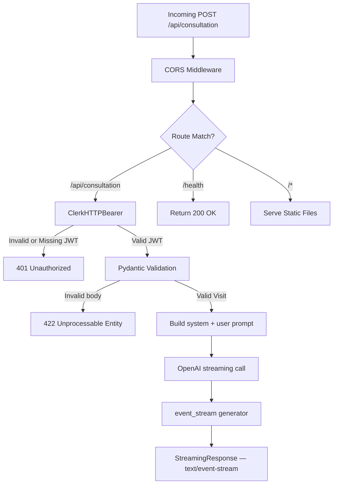
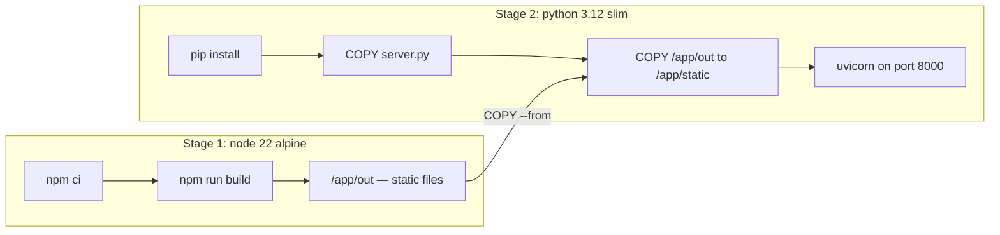
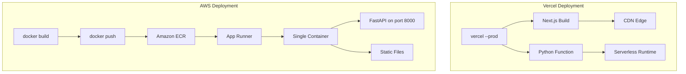
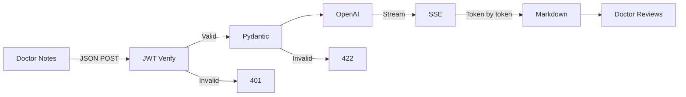
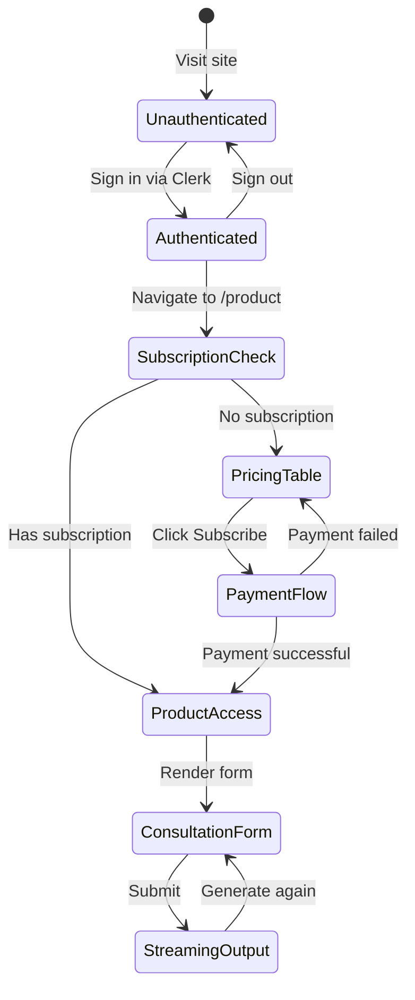

# Architecture Diagrams — MediNotes Pro

All diagrams are written in Mermaid syntax. Render them using:
- GitHub — auto-renders in `.md` files
- [mermaid.live](https://mermaid.live)
- VS Code with Mermaid extension

---

## 1. High-Level System Architecture

---

## 2. Authentication Sequence

---

## 3. Frontend Component Tree

---

## 4. Backend Request Pipeline

---

## 5. Docker Build Pipeline

---

## 6. Deployment Comparison

---

## 7. Data Flow - Simplified

---

## 8. Subscription Flow

---

## How to Use These Diagrams

### In GitHub README
GitHub natively renders Mermaid in `.md` files. Simply include the code blocks with the `mermaid` language tag.

### In Presentations
1. Visit [mermaid.live](https://mermaid.live)
2. Paste the diagram code
3. Export as SVG or PNG
4. Insert into slides

### In VS Code
Install the "Mermaid Markdown Syntax Highlighting" extension for preview support.
