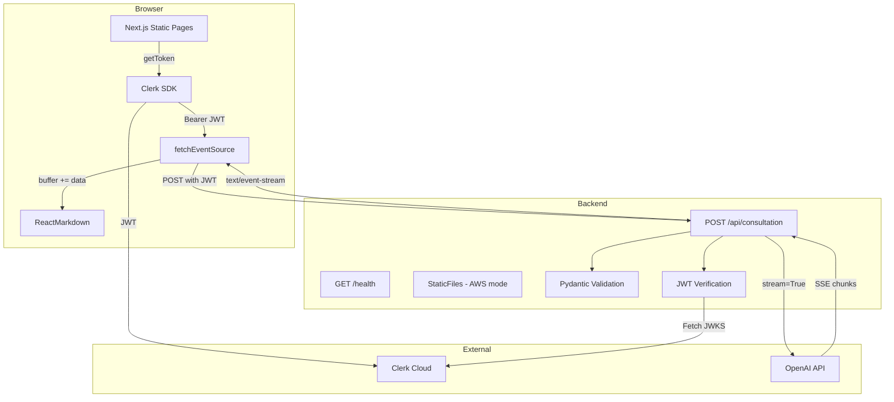
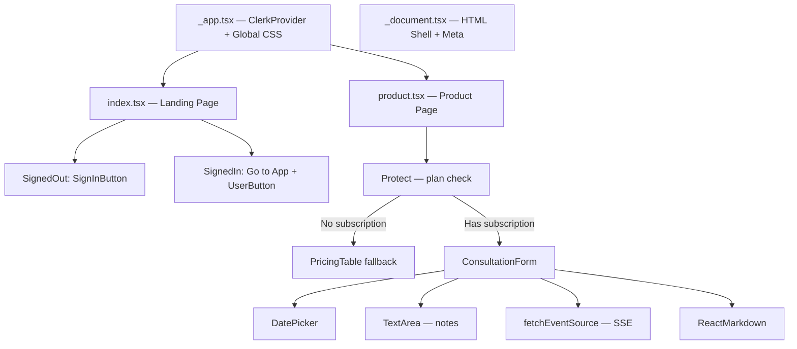
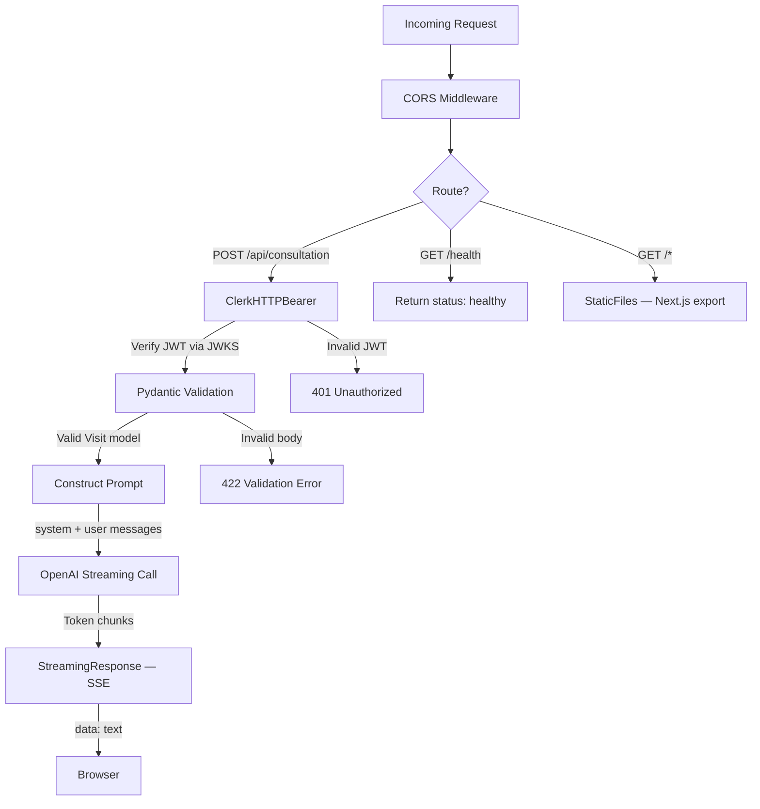
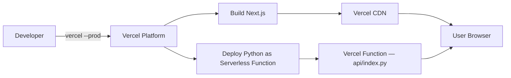
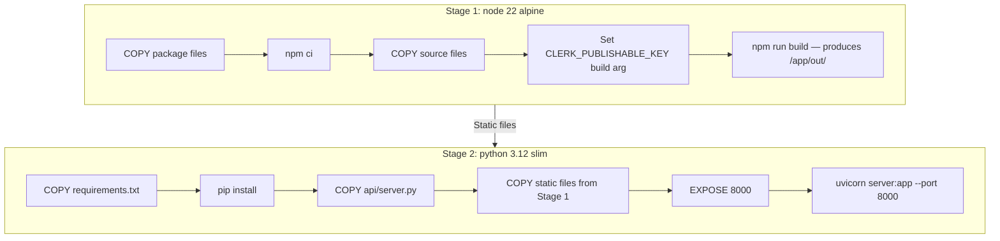
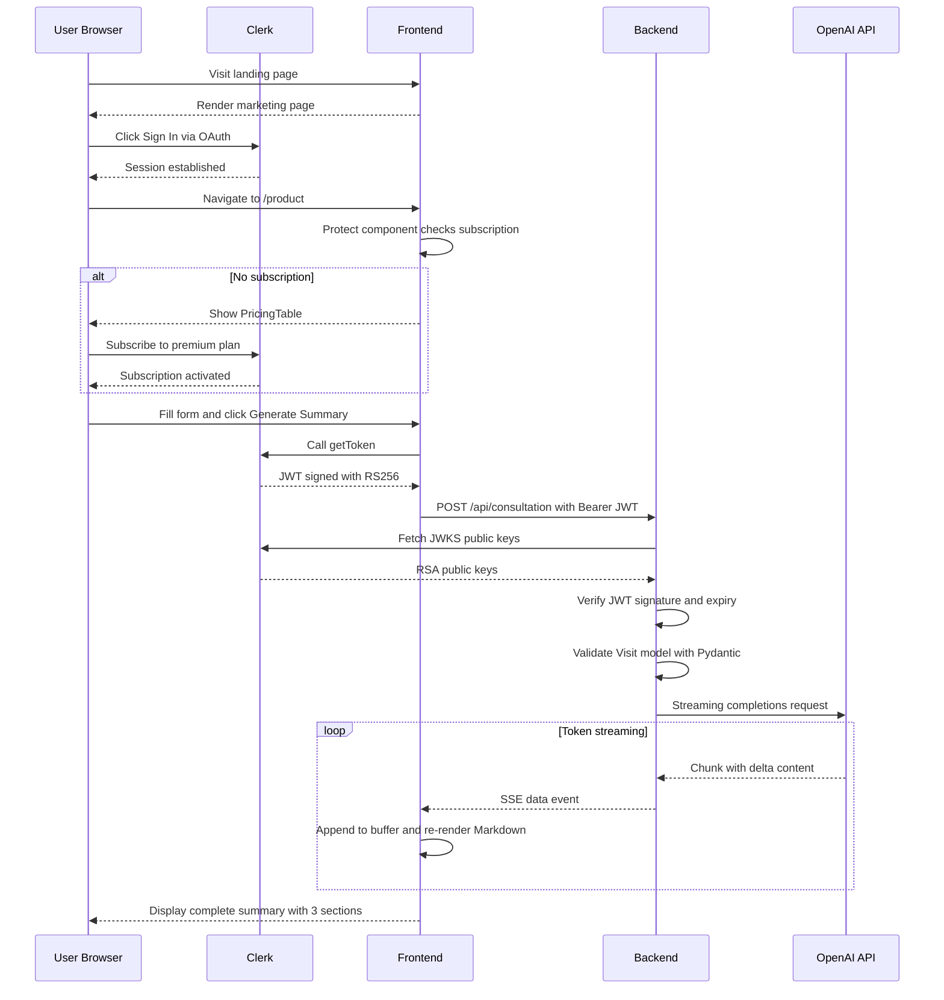
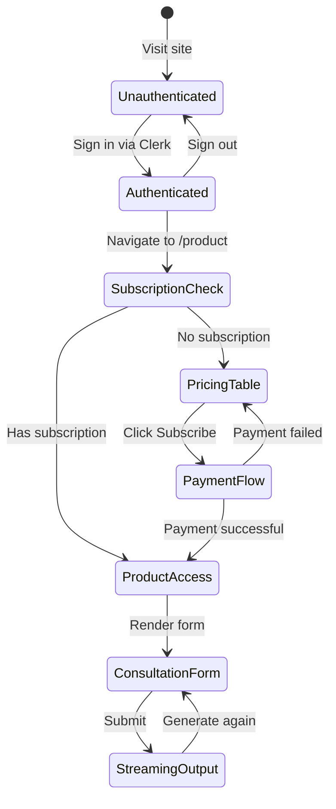
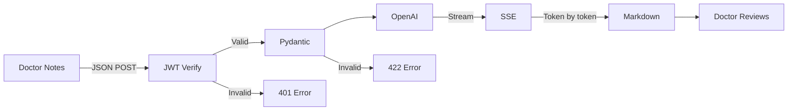

# Architecture — MediNotes Pro

## High-Level Architecture

MediNotes Pro follows a **client-rendered frontend + API backend** pattern with third-party services for authentication, billing, and AI inference.



## Component Architecture

### Frontend Components — Next.js Pages Router



### Backend Components — FastAPI



## Deployment Architecture

### Vercel Deployment — Days 1 through 4



### AWS Deployment — Day 5

```mermaid
graph LR
    DEV[Developer] -->|docker build| IMG[Docker Image]
    IMG -->|docker push| ECR[Amazon ECR]
    ECR -->|Pull on deploy| AR[AWS App Runner]

    AR --> CONTAINER[Container on port 8000]
    CONTAINER --> API_ROUTES[/api/consultation]
    CONTAINER --> HEALTH_EP[/health]
    CONTAINER --> STATIC_SRV["Static Files — Next.js export"]
```

### Docker Multi-Stage Build



## Sequence Diagrams

### Authentication and Request Flow



### Subscription State Flow



## Data Flow Summary



## Key Architecture Decisions

| Decision | Choice | Rationale |
|----------|--------|-----------|
| Pages Router over App Router | Pages Router | More stable, better community support, simpler mental model for client-side rendering |
| Client-side rendering | "use client" on all pages | Direct browser-to-API calls without Next.js middleware; simpler for Python backend |
| Static export for AWS | output: export | Eliminates Node.js server dependency; everything served from Python container |
| Single container | FastAPI serves API + static files | Simpler deployment; one port, one health check, one scaling unit |
| SSE over WebSockets | Server-Sent Events | Unidirectional server-to-client fits LLM streaming; simpler than WebSocket lifecycle |
| Clerk over Auth0/NextAuth | Clerk | Integrated billing, UI components, JWKS endpoint; minimal configuration |
| Pydantic over manual parsing | Pydantic BaseModel | Automatic validation, type coercion, clear error messages, OpenAPI schema generation |
| Manual deployment | CLI-based push | Appropriate for learning; CI/CD is a recommended enhancement |
